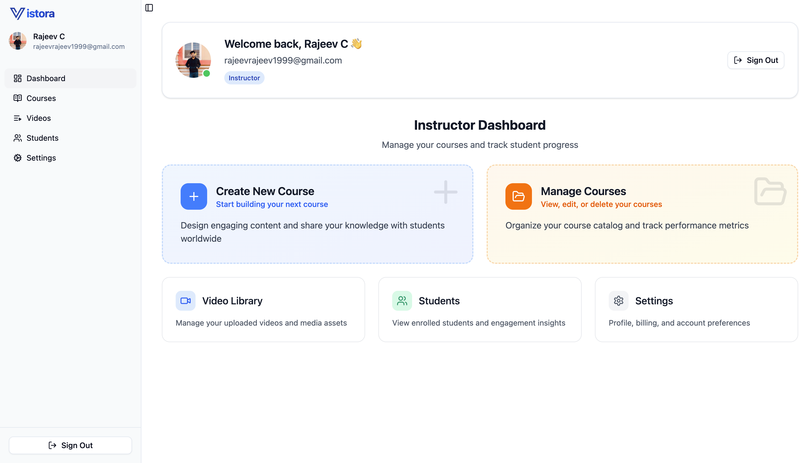

# Vistora

### Live site — Dashboard hero

[](https://vistora-edu.vercel.app/)

### Course player preview


Modern course platform with Google sign-in, curriculum management, video handling, and image processing — built with SvelteKit, Auth.js, Drizzle ORM (Neon), and the Trelae Files SDK.

## Overview

Think of Vistora as a streamlined course creator dashboard:

- Manage courses, modules, lessons, and materials.
- Upload thumbnails and materials to Trelae storage via presigned URLs.
- Generate secure download URLs for assets when needed.
- Process images server-side (resize, crop, flip, adjust, compress, convert, grayscale, blur) before saving.
- Track enrollments, favorites, and video progress.
- Google sign-in via Auth.js; users are stored in Postgres via Drizzle ORM.

## Everyday workflows

### Students
- Sign in with Google
- Browse courses, preview details, and enroll
- Resume where you left off with progress tracking

### Instructors
- Use the separate instructor login
- Create courses and modules; upload a course thumbnail
- Add lessons and materials (uploaded via Trelae presigned URLs)
- Transform images server-side when needed (resize/crop/adjust/etc.)
- Publish and share; secure download URLs power fast media delivery

> Students: sign in with Google and start learning. Instructors: use the instructor login to build courses, upload thumbnails/materials, and publish content. [Try Vistora](https://vistora-edu.vercel.app/)

## Description

Vistora is a full‑stack SvelteKit application that provides:

- Google sign‑in and session management via Auth.js
- Course creation, modules/lessons, enrollments, favorites, and progress tracking
- File storage using Trelae Files with presigned uploads and secure downloads
- Image transformations (resize, crop, flip, adjust, compress, convert, grayscale, blur)
- Clean dashboard UI for courses, videos, favorites, students, and settings

## Explanation

The app integrates Trelae Files to manage media for courses and thumbnails:

- A browser request asks the server for a presigned upload URL for a given course namespace. The server uses Trelae to issue a short‑lived `uploadUrl` and returns it to the client.
- The client PUTs the file directly to Trelae. The resulting `fileId` is stored in Postgres with relevant metadata.
- When displaying assets, the server fetches a signed download URL via Trelae at request time.
- The server can also apply transformations (resize/crop/adjust/etc.) before saving a new processed asset.

### Trelae SDK usage in this codebase

- Initialize client (`src/lib/utils/trelae.ts`):
  - `new Trelae({ apiKey: PUBLIC_TRELAE_API_KEY, devMode: false })`

- Namespaces
  - Create namespace for each course (on course creation):
    - `await trelae.createNamespace({ name, region: 'us-east-1', isPublic: false })`
  - Reference an existing namespace:
    - `const namespace = trelae.namespace(course.namespaceId)`
  - Delete a namespace (on course deletion):
    - `await trelae.namespace(course.namespaceId).delete()`

- Simple presigned uploads (thumbnails/materials)
  - Issue presigned upload URL in a course namespace:
    - `await trelae.namespace(course.namespaceId).getUploadUrl({ name, location: 'thumbnail' })`
  - Temporary namespace presign (utility flow):
    - `await trelae.createNamespace({ name: 'temp-...', region, isPublic: false })`
    - then `namespace.getUploadUrl({ name, location })`

- Multipart uploads (videos/large files)
  - Start multipart upload:
    - `const { id: fileId, uploadId, partSize, partCount, urls } = await trelae.namespace(namespaceId).startMultipartUpload({ name, location, size })`
  - Client uploads each part to returned `urls`
  - Complete multipart upload:
    - `await trelae.namespace(namespaceId).completeMultipartUpload({ fileId, uploadId, parts })`

- File download URLs
  - Generate signed URL when serving media/thumbs:
    - `await trelae.file(fileId).getDownloadUrl()`

- Image processing (see `src/routes/api/courses/[id]/thumbnails/update/+server.ts`)
  - `file.resize({ width, height, fastShrinkOnLoad: true, withoutEnlargement: true })`
  - `file.crop({ width, height, left, top, position })`
  - `file.flip({ horizontal, vertical })`
  - `file.adjust({ brightness, saturation, hue })`
  - `file.compress({ quality })`
  - `file.convert('jpeg' | 'png' | 'webp' | 'avif' | 'tiff' | 'gif')`
  - `file.grayscale()`
  - `file.blur({ sigma })`
  - `await file.save()`

- Bulk file operations
  - Delete multiple files by ids (module/lesson/material cleanup):
    - `await trelae.files(fileIds).delete()`

#### Example: presign and register a thumbnail

```ts
// Server: issue presigned URL
const { uploadUrl, id } = await trelae
  .namespace(course.namespaceId)
  .getUploadUrl({ name: 'thumbnail.png', location: 'thumbnail' });

// Client: PUT the file to uploadUrl, then send back { fileId: id, name }
```

#### Example: multipart upload for a video

```ts
// Server: start
const start = await trelae.namespace(nsId).startMultipartUpload({
  name: fileName,
  location: moduleTitle,
  size: fileSize,
});
// -> { fileId, uploadId, partSize, partCount, urls }

// Client: upload parts to each urls[i]

// Server: complete
await trelae.namespace(nsId).completeMultipartUpload({
  fileId: start.id,
  uploadId: start.uploadId,
  parts,
});
```

#### Example: transform image then save

```ts
let file = trelae.file(fileId)
  .resize({ width: 800, height: 450, fastShrinkOnLoad: true, withoutEnlargement: true })
  .crop({ width: 800, height: 450, left: 0, top: 0, position: 'center' })
  .compress({ quality: 80 })
  .convert('webp');
await file.save();
```

### Data model (Trelae‑related fields)

- `courses.namespaceId`: Trelae namespace id where a course’s assets live
- `courses.thumbnailFileId`: active thumbnail `fileId` for the course
- `course_thumbnails`: historical thumbnails with `{ fileId, name, location }`
- `course_materials`: additional assets with `{ fileId, name, fileType, location }`

## Packages

### Core

- `svelte`, `@sveltejs/kit`, `vite`
- `@sveltejs/adapter-auto`, `@sveltejs/adapter-vercel`

### UI

- `@lucide/svelte`, `lucide-svelte`
- `bits-ui`, `svelte-sonner`
- `tailwindcss`, `@tailwindcss/vite`, `tailwind-merge`, `tailwind-variants`, `tw-animate-css`

### Auth

- `@auth/core`, `@auth/sveltekit`

### Database

- `drizzle-orm`, `drizzle-kit`
- `pg`/Neon via `@neondatabase/serverless`

### Storage

- `trelae-files`

### Tooling

- `eslint`, `prettier`, `svelte-check`, `typescript`

## Usage

Prerequisites

- Node.js 18+ and `pnpm` installed
- A Postgres database (Neon recommended)
- Google OAuth credentials
- Trelae API key

### Clone and install

```bash
pnpm install
```

### Configure environment

Create `.env` (or set environment vars) with at least:

```bash
DATABASE_URL=postgresql://...           # Postgres connection (Neon URL is fine)
GOOGLE_CLIENT_ID=...                    # Google OAuth client id
GOOGLE_CLIENT_SECRET=...                # Google OAuth secret
AUTH_SECRET=...                         # Any long random string
AUTH_TRUST_HOST=true                    # Allow Auth.js to trust dev host
PUBLIC_TRELAE_API_KEY=...               # Trelae Files SDK API key
```

If you use a different dev origin, you may also set:

```bash
AUTH_ORIGIN=http://localhost:5173
```

### Initialize database (Drizzle)

```bash
pnpm db:push     # push schema
# or
pnpm db:migrate  # run generated migrations (if any)
pnpm db:studio   # optional: explore DB in Drizzle Studio
```

### Start in development

```bash
pnpm dev
```

Visit `http://localhost:5173`.

### Build and preview

```bash
pnpm build
pnpm preview
```

## App Structure

### Top‑level

- `src/`: SvelteKit routes, lib, and assets
- `src/lib/server/db/`: Drizzle schema and DB setup
- `src/lib/utils/trelae.ts`: Trelae Files SDK client
- `static/`: static assets
- `drizzle.config.ts`, `vite.config.ts`, `svelte.config.js`: project config

### Routes

- `src/routes/+page.svelte`: landing/login
- `src/routes/dashboard/...`: main dashboard (courses, videos, favorites, students, settings)

### API's (Core Flow)

- `src/routes/api/courses/+server.ts`
  - POST: create a course and its Trelae namespace; optionally register a thumbnail
- `src/routes/api/courses/[id]/+server.ts`
  - DELETE: delete course and its Trelae namespace; PUT: update metadata

- `src/routes/api/courses/[id]/thumbnails/get-upload-url/+server.ts`
  - POST: presigned upload URL for a course thumbnail in its namespace
- `src/routes/api/courses/[id]/thumbnails/+server.ts`
  - GET: list thumbnails with signed URLs; POST: register uploaded `fileId`; PUT: set active thumbnail
- `src/routes/api/courses/[id]/thumbnails/update/+server.ts`
  - POST: apply Trelae image transformations (`resize/crop/flip/adjust/compress/convert/grayscale/blur`) then `save()`

- `src/routes/api/modules/[moduleId]/lessons/+server.ts`
  - POST: start multipart upload (returns part URLs) for large lesson videos
- `src/routes/api/modules/[moduleId]/lessons/complete/+server.ts`
  - POST: complete multipart upload and create the video record
- `src/routes/api/modules/[moduleId]/lessons/bulk-delete/+server.ts`
  - POST: bulk delete lesson files from Trelae and DB

- `src/routes/api/videos/[fileId]/download-url/+server.ts`
  - GET: signed download URL `{ url }` for rendering media

- `src/routes/api/image-proxy/+server.ts`
  - GET: CORS‑friendly proxy when embedding remote images

## Trelae integration details (concise)

- Presigned uploads (thumbnails/materials)
  - Server: `namespace(course.namespaceId).getUploadUrl({ name, location })`
  - Client: PUT to `uploadUrl`; Server: register `fileId`; optionally set active thumbnail

- Multipart uploads (large lessons/videos)
  - Start: `namespace(nsId).startMultipartUpload({ name, location, size })`
  - Complete: `namespace(nsId).completeMultipartUpload({ fileId, uploadId, parts })`

- Download URLs
  - `file(fileId).getDownloadUrl()` whenever rendering images/videos

- Image transforms (server‑side)
  - Chain: `resize` · `crop` · `flip` · `adjust` · `compress` · `convert` · `grayscale` · `blur` → `save()`

- Bulk deletes
  - `files([fileId,...]).delete()` for module/lesson cleanup

## Security notes

- `PUBLIC_TRELAE_API_KEY` is used to initialize the SDK on the server and client; privileged operations (presign/transform/save) happen only in server routes.
- Presigned upload and download URLs are short‑lived; store only `fileId` in the database.
- Image transformations run on the server to prevent exposing processing internals and to centralize auditing.

## Scripts

- `pnpm dev`: run SvelteKit dev server
- `pnpm build`: build for production
- `pnpm preview`: preview the production build locally
- `pnpm check`, `pnpm check:watch`: Svelte type checks
- `pnpm lint`, `pnpm format`: formatting and linting
- `pnpm db:push`, `pnpm db:migrate`, `pnpm db:studio`: Drizzle database tasks

## Useful Links

- [Trelae](https://trelae.com/)
- [Trelae SDK](https://www.npmjs.com/package/trelae-files)
- [GitHub](https://github.com/rajeevc5260/vistora.git)
- [LinkedIn](https://www.linkedin.com/in/rajeev-c-596a59223/)
